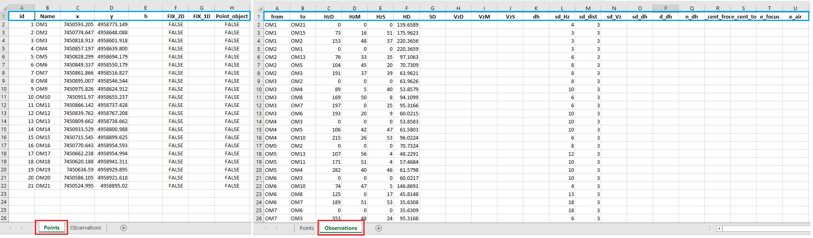
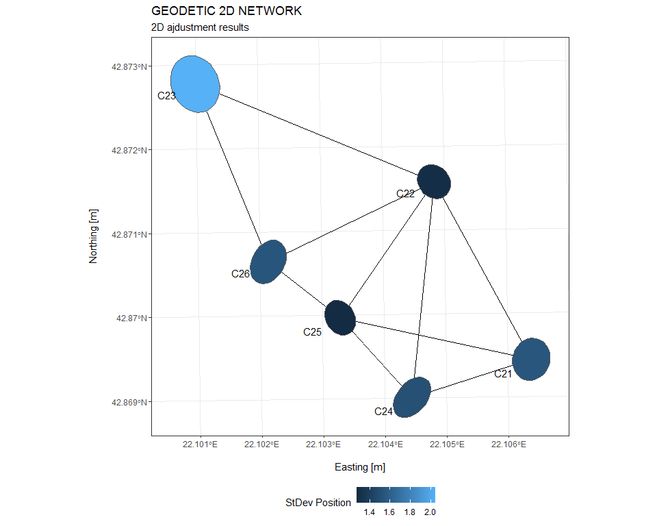
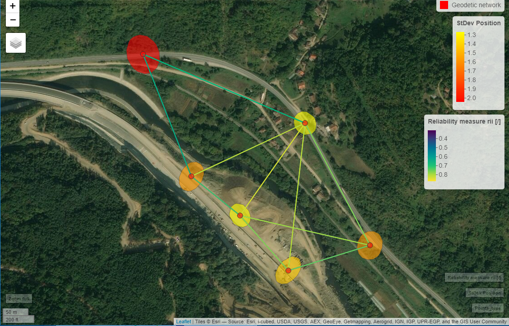
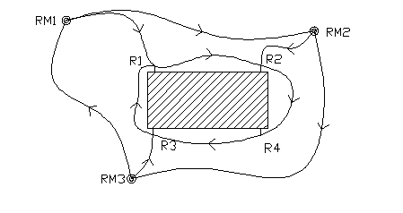

<!-- README.md is generated from README.Rmd. Please edit that file -->

```{r, include = FALSE}
knitr::opts_chunk$set(
  collapse = TRUE,
  comment = "#>",
  fig.path = "man/figures/README-",
  out.width = "100%"
)
```
# Surveyor

<!-- badges: start -->
<!-- badges: end -->

Description: Package of Land and Engineering Surveying utilities.      
Authors: Dr Milutin Pejovic, Petar Bursac, Dr Milan Kilibarda, Aleksandar Sekulic and Dr Branislav Bajat.      
University of Belgrade, Faculty of Civil Engineering, Department of geodesy and geoinformatics      

This work presents the R package surveyor, which provides the functionalities for common engineering surveying tasks, including designing and adjusting 1D and 2D geodetic networks, coordinate transformation and deformation analysis. The package implements least-square based calculation to evaluate the observations and the network characteristics. Package surveyor utilizes state-of-the-art spatial data structures implemented in sf R package to provide a spatial abstraction of geodetic network. Therefore, it leverages all the related functionalities from the set of packages and libraries for geospatial analysis and visualization.

## Installation

To install the development version from [GitHub](https://github.com/pejovic/Surveyor) you can install the devtools package with:

``` r
install.packages("devtools")
devtools::install_github("pejovic/Surveyor")
```
## Usage


### Input data 
The data must be prepared as given in the figure, the points tab contains clearly defined columns as well as the observations tab. The file needs to be in Excel .xlsx format.




Input data are given in the form of two tables, one containing data of geodetic points, their approximate coordinates, and the selection of points defining the datum of the network. The second table contains measurements and/or a selection of measurements that make up the observation plan, observational equipment precision for the directions and distances and elevation differences.

### Abstraction of geodetic network - survey.net

First you need to show the path to the input file:
``` r
file_path <- here::here("Data/Input/With_observations/Grdelica/Grdelica.xlsx")
```
Calling the function creates the basic object survey.net:

``` r
grdelica.snet <- read_surveynet(file = file_path)
```
Result is a list of two sf classes, the first representing the geometry and descriptive attributes of the points of the geodetic network and the second with linestrings and associated observational plan. The data are given in the defined CRS - Reference Coordinate System.

### Network design 

Package functionality that enables the design of 1D and 2D geodetic networks, created by using functions with least-square based calculation, can be called as follows:


``` r
grdelica.snet.des <- adjust.snet(adjust = FALSE, survey.net = grdelica.snet, dim_type = "2D", sd.apriori = 3,  all = FALSE)
```

### Network adjustment

Package functionality that enables the adjustment of 1D and 2D geodetic networks, created by functions based on least-square calculation, can be called as follows:


``` r
grdelica.snet.adj <- adjust.snet(adjust = TRUE, survey.net = grdelica.snet, dim_type = "2D", sd.apriori = 3,  maxiter = 50, prob = 0.95, result.units = "cm", all = FALSE)
```
``` {r include = TRUE, echo = FALSE, results = 'hide', warning = FALSE, message = FALSE}
library(shiny)
library(shinythemes)
library(leaflet)
library(tidyverse)
library(magrittr)
library(ggplot2)
library(sf)
library(ggmap)
library(sp)
library(rgdal)
library(leaflet)
library(readxl)
library(data.table)
library(plotly)
library(mapview)
library(shinycssloaders)
library(here)
library(matlib)
library(nngeo)
library(dplyr)
library(mapedit)
library(DT)
library(leaflet.extras)
library(rhandsontable)
library(shinyBS)
library(shinyWidgets)
library(knitr)
library(rmarkdown)
library(knitr)
library(kableExtra)

```


``` {r eval=F, echo=F, message = F, warning = F}
source("D:/R_projects/Surveyer/R/functions.r")
file_path <- "D:/R_projects/Surveyer [dodatno]/Rmarkdown_usage/Grdelica.xlsx"
grdelica.snet <- read_surveynet(file = file_path, dest_crs = 3909)
grdelica.snet.adj <- adjust.snet(adjust = TRUE, survey.net = grdelica.snet, dim_type = "2D", sd.apriori = 1 ,  all = FALSE, ellipse.scale = 10)

```

Visualization of the results is possible using ggplot2 package:

``` r
plotSurveynet <- function(snet.adj = snet.adj){
  snet.adj$Points$ellipse.net %<>% dplyr::rename(`StDev Position` = sp)
  adj.net_plot <- ggplot() +
    geom_sf(data = snet.adj$Observations)+
    geom_sf(data = snet.adj$Points$ellipse.net, aes(fill = `StDev Position`, alpha = 10))+
    geom_sf_text(data = snet.adj$Points$ellipse.net,
                 aes(label=Name,
                     hjust = 2,
                     vjust = 2))+
    xlab("\nEasting [m]") +
    ylab("Northing [m]\n") +
    ggtitle("GEODETIC 2D NETWORK")+
    labs(subtitle = "2D ajdustment results")+
    guides(col = guide_legend())+
    theme_bw()+
    theme(legend.position = 'bottom')
  return(adj.net_plot)
}
```

``` r 
plotSurveynet(snet.adj = grdelica.snet.adj)
```



Visualization of the results is also possible using mapview package:

``` r 
mapviewSurveynet <- function(snet.adj = snet.adj, epsg = 3909){
  points <- snet.adj$Points$net.points
  points %<>% dplyr::mutate(Point_type = dplyr::case_when(Point_object == FALSE ~ "Geodetic network",
                                                          Point_object == TRUE ~ "Points at object"))
  observations <- snet.adj$Observations
  ellipses <- snet.adj$Points$ellipse.net
  webmap.net.adj <- mapview(points, zcol = "Point_type", col.regions = c("red","grey"), layer.name = "Points_type") +
    mapview(ellipses, zcol = "sp", col.regions = c("yellow", "red"), layer.name = "StDev Position")+
    mapview(observations, zcol = "rii", layer.name = "Reliability measure rii [/]") 
  return(webmap.net.adj)
}
```

``` r 
mapviewSurveynet(snet.adj = grdelica.snet.adj)
```


### Deformation analysis

Package functionality that enables the deformation analysis of 1D and 2D geodetic networks, created by functions based on least-square calculation, can be called as follows:

``` r
deform.snet(snet_1_path = "inst/extdata/snet1D_epoch_1.xlsx", snet_2_path = "inst/extdata/net1D_epoch_2.xlsx", sd.apriori = 0.5, units = "mm",  dim_type = "1D", prob = 0.95, wdh_model = "n_dh")
```



``` {r eval = T, echo = F}
source(here::here("R/functions.r"))
source(here::here("R/Deformation_analysis_functions.r"))
```

``` {r eval = T, echo = T}
deform.snet(snet_1_path = "inst/extdata/snet1D_epoch_1.xlsx", snet_2_path = "inst/extdata/snet1D_epoch_2.xlsx", sd.apriori = 0.5, units = "mm",  dim_type = "1D", prob = 0.95, wdh_model = "n_dh")
```

## Contact

Please file bug reports and feature requests send as email at mpejovic@grf.bg.ac.rs.
